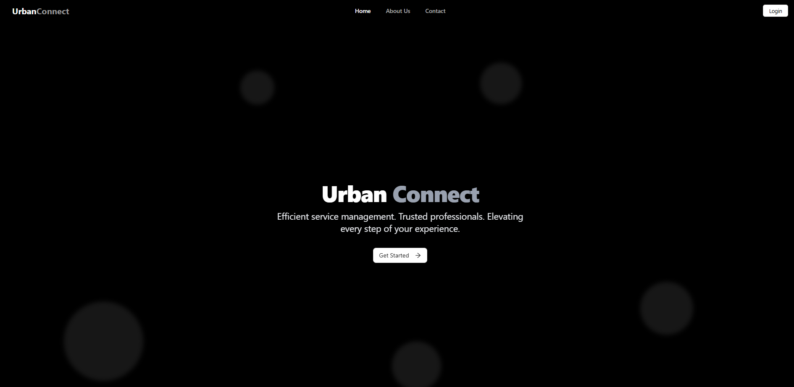

# UrbanConnect

## 1. Overview

UrbanConnect is engineered as a scalable, secure, and efficient platform for booking home and lifestyle services. The application emphasizes technical robustness—through conflict-free scheduling, real-time updates, strong access control, and a responsive interface—to deliver seamless user and administrative experiences.

## 2. Application Features

## 2.1 Landing & Navigation

- **Navbar Includes:** Home, About Us, Contact Us, Login
- **Navigation Logic:** Simple, top-level menu structure for intuitive user journeys.
- **Landing Experience:** Users are greeted with branding, mission statement, and high-clarity call-to-action.




## 2.2 Authentication & Roles

- **Auth Provider:** Clerk
- **Login Mechanics:** All dashboard and booking routes are protected; access requires successful authentication.
- **First-Time User:** New users on first sign-in are assigned a default 'customer' role.
- **Role-Based Access:** Admin-specific routes and controls appear dynamically for admin users.
    
    
    

## 2.3 Dashboard Experience

Upon login, users access a structured **dashboard** including:

- **Welcome Banner:** Personalized greeting.
- **Action Buttons:** For booking services, viewing past orders, and accessing admin dashboard (if applicable).
- **Summary Cards:**
    - *Upcoming Appointments:* Next scheduled service.
    - *Completed Bookings:* History of fulfilled bookings with options to give feedback.
    - *Statistics:* Count of past and upcoming bookings.
- **Admin Panel:** Exclusive button visible to admins for advanced controls.


## 2.4 Service Booking Workflow

1. **Category Selection:** User chooses a service category (e.g., appliances, cleaning, grooming).
    
    
    
2. **Service Discovery:** Available services within the chosen category are displayed with descriptions and durations.
    
    
    
3. **Date & Time Picking:** Past dates are disabled to prevent invalid bookings.
4. **Professional Selection:** Upon service and date selection, the system shows all qualified professionals along with:
    - Available time slots (dynamically generated based on service duration and daily availability from 10:00 to 17:00)
    - Ratings
    - Bio/Description
        
        
        
5. **Slot Booking Logic:**
    - Time slots are computed by splitting daily availability per service duration.
    - When a slot is booked, the system updates the professional’s availability, splits the record, and prevents overlapping reservations.
        
        
        

## 2.5 Booking Management (View, Cancel, Reschedule)

- **View Past Bookings:** Users access a list with booking ID, service details, date/time, and professional.
- **Leave a Review:** Option to rate and comment post-completion.


- **Upcoming Bookings:** View, cancel, or reschedule.
    - **Cancellation:** Sets appointment status to "CANCELED", excludes from active views.
    - **Rescheduling:** Presents available slots for the assigned professional, using the same slot logic as initial booking.
        
        
        
        
        

## 2.6 Reviews & Ratings

- **Submission:** Users rate professionals and leave comments for completed bookings.
- **Storage:** Ratings stored in **`professional_reviews`**.
- **Aggregation:** Average ratings for each professional are calculated and updated in **`professional_details`**.
- **Display:** Top professionals ranked by total bookings and ratings; shown on dashboard.
    
    
    

## 2.7 Admin Role & Controls

- **Visibility:** Admin-specific controls and dashboard appear only for users with 'admin' role.
- **Access Control:** Route protection ensures only authorized admins can access management features.


## 3. Database & Backend Architecture

## 3.1 Schema Overview

- **users:** User profile, authentication, and role (customer/professional/admin).
- **professional_details:** Additional info and current rating for professionals.
- **professional_availability:** Tracks professional daily availability and booked slots.
- **bookings:** All booking details, including status (BOOKED, COMPLETED, CANCELED, RESCHEDULED).
- **professional_reviews:** Stores review submissions per booking.
- **services :** Service catalog professional-to-service mapping.
- **professional_services: P**rofessional-to-service mapping.


## 4. Security & Access Control

- **Authentication Enforcement:** Protected routes for booking, dashboard, and admin areas.
- **Role-Based Visibility:** UI elements rendered based on authenticated user's role.
- **Auditability:** Booking status changes and role assignments tracked in the database.

# Additional Requirements:

## 1. Manage professional availability and prevent scheduling conflicts:

This project manages professional availability dynamically using the **`professional_availability`** table, where each record stores a professional’s daily availability with attributes such as **`professional_id`**, **`date`**, **`start_time`**, and **`end_time`** (for example, 10:00 to 17:00). Each service’s duration is defined in the **`services`** table with the attribute **`durationMinutes`**.

When a user selects a date and a specific service, the system calculates bookable time slots by splitting the professional’s available time window into contiguous intervals based on the service’s **`durationMinutes`**. For example, a 90-minute service duration divides the time window into slots like 10:00–11:30, 11:30–13:00, etc.

Once the user books a particular slot (e.g., 12:00–14:00), the **`professional_availability`** record for that day is updated by splitting the existing availability interval into two new intervals to exclude the booked time slot:

- The original **`start_time`** and **`end_time`** (10:00–17:00) are adjusted to two new records with updated **`start_time`** and **`end_time`** values — one before the booked slot (10:00–12:00) and one after (14:00–17:00).

Simultaneously, an entry is created in the **`bookings`** table with attributes such as **`booking_id`**, **`user_id`**, **`professional_id`**, **`service_id`**, **`start_time`**, **`end_time`**, and **`status`** (set to **`"BOOKED"`**).

When other users attempt to book a service with the same professional on the same day, the system retrieves the current availability from **`professional_availability`** and only presents the remaining free slots (excluding those already booked). This ensures that booked intervals do not appear as options, effectively preventing scheduling conflicts.

## 2. Approaches to scale the system to support thousands of users concurrently:

To scale the system for thousands of concurrent users, the application should be architected using a microservices approach, allowing independent scaling of key components such as booking, user management, and notifications. Containerization with orchestration tools like Kubernetes facilitates automated scaling and resilience. Load balancers distribute incoming traffic evenly across multiple stateless application servers, which store session state externally using caches like Redis to support horizontal scalability. The database layer benefits from read replicas, indexing, query optimization, and sharding to manage growing data volume and avoid bottlenecks. Caching frequently accessed data and serving static assets via CDNs reduce latency and offload backend resources. Real-time updates and conflict prevention leverage distributed locks or atomic transactions to maintain booking integrity under high concurrency. Continuous monitoring and automated infrastructure provisioning ensure the system adapts dynamically to usage patterns, maintaining reliability and performance even at scale.

## 3. SQL Queries:

Write 2 example SQL queries: one to list upcoming bookings for a user, and another to identify the top 3 most booked professionals.

- List Upcoming bookings for a user:
    
    ```bash
    SELECT b.booking_id,
        b.user_id,
        b.professional_id,
        b.service_id,
        b.scheduled_start,
        b.scheduled_end,
        b.status,
        s.name AS service_name,
        p.name AS professional_name
    FROM bookings b
        JOIN services s ON b.service_id = s.service_id
        JOIN users p ON b.professional_id = p.user_id
    WHERE b.user_id = p_userId
        AND b.scheduled_start > UTC_TIMESTAMP()
        AND b.status IN ('BOOKED', 'RESCHEDULED')
    ORDER BY b.scheduled_start ASC;
    ```
    
- Identify the top 3 most booked professionals
    
    ```bash
    SELECT u.user_id,
        u.name AS professional_name,
        pd.rating,
        pd.profile_bio,
        GROUP_CONCAT(
            DISTINCT s.name
            ORDER BY s.name SEPARATOR ', '
        ) AS services_offered,
        COUNT(b.booking_id) AS total_bookings
    FROM users u
        JOIN bookings b ON u.user_id = b.professional_id
        LEFT JOIN professional_reviews r ON b.booking_id = r.booking_id
        LEFT JOIN professional_details pd ON u.user_id = pd.professional_id
        LEFT JOIN professional_services ps ON u.user_id = ps.professional_id
        LEFT JOIN services s ON ps.service_id = s.service_id
    WHERE u.role = 'professional'
    GROUP BY u.user_id,
        u.name,
        pd.rating,
        pd.profile_bio
    ORDER BY total_bookings DESC
    LIMIT 3;
    ```
    

# Challenges faced:

The key challenges in this project revolved around accurate time handling, dynamic slot splitting, and availability checking to prevent scheduling conflicts.

The time zone mismatch—where the application frontend and APIs transmitted times in UTC while the database stored them in IST—had to be resolved by implementing a frontend utility function that consistently converts all UTC times to IST before displaying them to users. This ensured that the backend could operate with standardized UTC timestamps for logic and storage, while the frontend rendered times accurately in the local IST zone, maintaining synchronization and preventing booking confusion.

The issue of splitting professional availability into variable-length booking slots based on service duration had to be addressed by designing a mechanism to dynamically partition each professional’s daily availability window (stored in the **`professional_availability`** table with attributes like **`start_time`** and **`end_time`**) into contiguous intervals matching the selected service’s **`durationMinutes`**. When a slot was booked, this availability window was updated by splitting it around the booked interval—creating new availability intervals before and after the booking (for example, splitting 10:00–17:00 into 10:00–12:00 and 14:00–17:00 if 12:00–14:00 was booked)—and updating the records accordingly to reflect accurate current availability.

To prevent overlapping bookings caused by concurrent access, the system relies on querying the **`bookings`** table to detect any active bookings with statuses **`"BOOKED"`** or **`"RESCHEDULED"`** that overlap the requested time slot before confirming a new reservation. By ensuring that only time slots without conflicts are accepted, the system maintains data consistency and helps avoid scheduling clashes.
